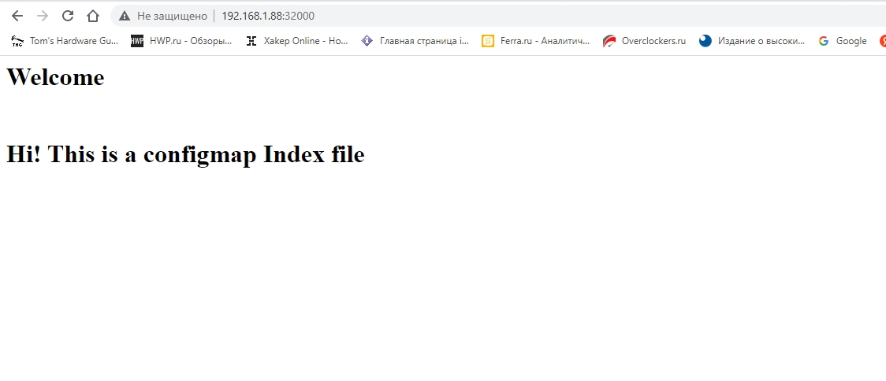
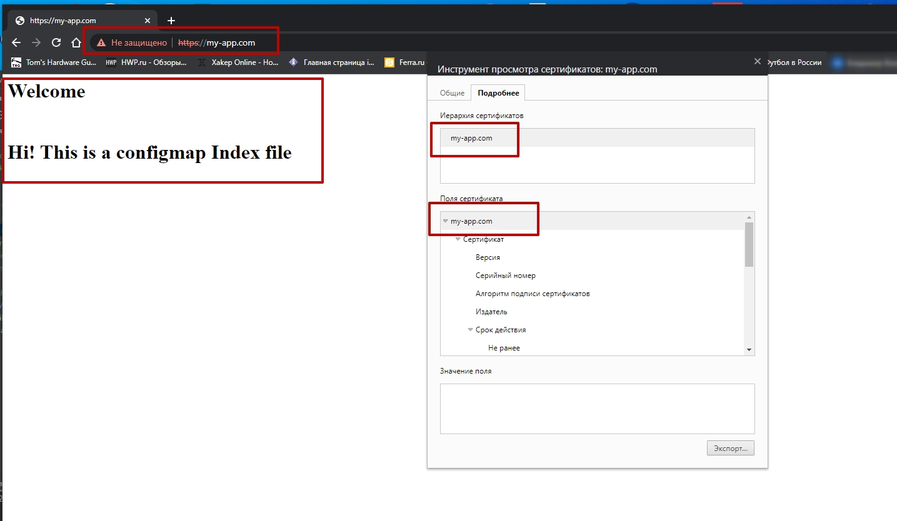

# Домашнее задание к занятию "Конфигурация приложений" Соловьев Д.В.
"Конфигурация приложений"

### Цель задания

В тестовой среде Kubernetes необходимо создать конфигурацию и продемонстрировать работу приложения.

------

### Чеклист готовности к домашнему заданию

1. Установленное k8s-решение (например, MicroK8S).
2. Установленный локальный kubectl.
3. Редактор YAML-файлов с подключенным github-репозиторием.

------

### Инструменты/ дополнительные материалы, которые пригодятся для выполнения задания

1. [Описание](https://kubernetes.io/docs/concepts/configuration/secret/) Secret
2. [Описание](https://kubernetes.io/docs/concepts/configuration/configmap/) ConfigMap
3. [Описание](https://github.com/wbitt/Network-MultiTool) Multitool

------

### Задание 1. Создать Deployment приложения и решить возникшую проблему с помощью ConfigMap. Добавить web-страницу

1. Создать Deployment приложения, состоящего из контейнеров busybox и multitool.
2. Решить возникшую проблему с помощью ConfigMap
3. Продемонстрировать, что pod стартовал, и оба конейнера работают.
4. Сделать простую web-страницу и подключить ее к Nginx с помощью ConfigMap. Подключить Service и показать вывод curl или в браузере.
5. Предоставить манифесты, а также скриншоты и/или вывод необходимых команд.

#### Решение

Из предыдущего задания взял Deployment приложения, состоящего из контейнеров busybox и multitool. 
Где busybox является `initContainers`, хотя исходя из условия задачи не понимаю вообще зачем нужно два контейнера для демонстрации работы ConfigMap. Ну надо так надо.
Доработал Deployment. Для проверки созданной мной страницы создал `Service`(Он же нужен выполнения условия поднятия контейнера multitool).
Ну и создал `ConfigMap` для добавления моего файла - `index.html`

Мои манифесты:

- [Deployment](file/ConfigMapDep.yaml)
- [Service](file/myservice.yaml)
- [ConfigMap](file/index-html-configmap.yaml)

```bash
$ kubectl apply -f file/myservice.yaml 
service/myservice created

$ kubectl get service
NAME         TYPE        CLUSTER-IP       EXTERNAL-IP   PORT(S)                         AGE
kubernetes   ClusterIP   10.152.183.1     <none>        443/TCP                         38d
myservice    NodePort    10.152.183.153   <none>        80:32000/TCP                    10s

$ kubectl apply -f file/index-html-configmap.yaml 
configmap/index-html-configmap created

$ kubectl get cm
NAME                   DATA   AGE
kube-root-ca.crt       1      38d
index-html-configmap   1      13s

$ kubectl apply -f file/ConfigMapDep.yaml 
deployment.apps/myapp-pod created

$ kubectl get pod
NAME                         READY   STATUS    RESTARTS   AGE
myapp-pod-5bb5fbc745-tn2nx   1/1     Running   0          20s
```

```bash
$ kubectl describe pod myapp-pod-5bb5fbc745-tn2nx
Name:         myapp-pod-5bb5fbc745-tn2nx
Namespace:    default
Priority:     0
Node:         microk8s/192.168.1.88
Start Time:   Tue, 21 Mar 2023 23:46:53 +0300
Labels:       app=myapp
              pod-template-hash=5bb5fbc745
Annotations:  cni.projectcalico.org/containerID: 6803c4d2220a4f790c43726c26e6d887560768e0ac16eac9e691e7b10ca9b4db
              cni.projectcalico.org/podIP: 10.1.128.221/32
              cni.projectcalico.org/podIPs: 10.1.128.221/32
Status:       Running
IP:           10.1.128.221
IPs:
  IP:           10.1.128.221
Controlled By:  ReplicaSet/myapp-pod-5bb5fbc745
Init Containers:
  init-myservice:
    Container ID:  containerd://deef8650813540c4b342bc27a2b5795d1a09c16e378adeb6249e6ff762a9a31a
    Image:         busybox:1.28
    Image ID:      docker.io/library/busybox@sha256:141c253bc4c3fd0a201d32dc1f493bcf3fff003b6df416dea4f41046e0f37d47
    Port:          <none>
    Host Port:     <none>
    Command:
      sh
      -c
      until nslookup myservice.$(cat /var/run/secrets/kubernetes.io/serviceaccount/namespace).svc.cluster.local; do echo waiting for myservice; sleep 2; done
    State:          Terminated
      Reason:       Completed
      Exit Code:    0
      Started:      Tue, 21 Mar 2023 23:46:57 +0300
      Finished:     Tue, 21 Mar 2023 23:46:57 +0300
    Ready:          True
    Restart Count:  0
    Environment:    <none>
    Mounts:
      /var/run/secrets/kubernetes.io/serviceaccount from kube-api-access-7r5c6 (ro)
Containers:
  network-multitool:
    Container ID:   containerd://be469c26ac4d72641408d4bb37dda0fd3cc4fa9a2bf5816f21072d1436bc640a
    Image:          wbitt/network-multitool
    Image ID:       docker.io/wbitt/network-multitool@sha256:82a5ea955024390d6b438ce22ccc75c98b481bf00e57c13e9a9cc1458eb92652
    Port:           <none>
    Host Port:      <none>
    State:          Running
      Started:      Tue, 21 Mar 2023 23:46:58 +0300
    Ready:          True
    Restart Count:  0
    Limits:
      cpu:     200m
      memory:  512Mi
    Requests:
      cpu:        100m
      memory:     256Mi
    Environment:  <none>
    Mounts:
      /usr/share/nginx/html/ from nginx-index-file (rw)
      /var/run/secrets/kubernetes.io/serviceaccount from kube-api-access-7r5c6 (ro)
Conditions:
  Type              Status
  Initialized       True
  Ready             True
  ContainersReady   True
  PodScheduled      True
Volumes:
  nginx-index-file:
    Type:      ConfigMap (a volume populated by a ConfigMap)
    Name:      index-html-configmap
    Optional:  false
  kube-api-access-7r5c6:
    Type:                    Projected (a volume that contains injected data from multiple sources)
    TokenExpirationSeconds:  3607
    ConfigMapName:           kube-root-ca.crt
    ConfigMapOptional:       <nil>
    DownwardAPI:             true
QoS Class:                   Burstable
Node-Selectors:              <none>
Tolerations:                 node.kubernetes.io/not-ready:NoExecute op=Exists for 300s
                             node.kubernetes.io/unreachable:NoExecute op=Exists for 300s
Events:                      <none>
```

Проверяем curl

```bash
$ curl 192.168.1.88:32000
<html>
<h1>Welcome</h1>
</br>
<h1>Hi! This is a configmap Index file </h1>
</html
```

И через браузер



------

### Задание 2. Создать приложение с вашей web-страницей, доступной по HTTPS 

#### Решение

1. Создать Deployment приложения состоящего из nginx.

   - [Deployment2](file/2/ConfigMapDep2.yaml)

   Тот же образ, что и в первом задании. Есть веб-сервер и есть созданная страница с помощью ConfigMap 
2. Создать собственную web-страницу и подключить ее как ConfigMap к приложению.

   - [ConfigMap](file/index-html-configmap.yaml)

3. Выпустить самоподписной сертификат SSL. Создать Secret для использования данного сертификата.

```bash
root@microk8s:~# openssl req -x509 -newkey rsa:4096 -sha256 -nodes -keyout tls.key -out tls.crt -subj "/CN=my-app.com" -days 365
.....+........+......+..........+..+...+.+......+..+...+..........+.....+++++++++++++++++++++++++++++++++++++++++++++++++++++++++++++++++*......+.+...+......+.........+..+..................+.+.....+....+......+.....+++++++++++++++++++++++++++++++++++++++++++++++++++++++++++++++++*.+.+..................+..+................+.........+........+.+..............+.+.....+.+.........+.....+.+.....+.+..+...+...+.+......+............+...+...+..+..........+..+...+.............+......+........+.+.........+.................+......+...+.+...........+.......+..+.+........+......+...+.+...........+...+......+....+.....+..........+...+........+.......+.........+...........+.........+.+............+..+.+..+.......+.....+...+.......+.........+.........+......+...........+......+...+.......+..+............................+.........+.....+...+......+................+++++++++++++++++++++++++++++++++++++++++++++++++++++++++++++++++
..................+..+++++++++++++++++++++++++++++++++++++++++++++++++++++++++++++++++*..+........+++++++++++++++++++++++++++++++++++++++++++++++++++++++++++++++++*............................+............+....+.........+....................+...+...+..........+.........+...+........+.......+...............+.....+.........+.........+.........+...+...............+....+...........+...+.+.........+.....+............+.........+...+.......+...+........+.........+...+..........+................................+...+......+.........+.............+.........+...+..+.+..................+......+........+...+.......+...............+.....+............+.+.....+...+.+...+...+............+...+.....+..........+..+.......+...+.....+......+...................+...+........+...............+.+...............+......+............+.....+.....................+.+...+...........+.......+..............+...+.+.........+...+........+.+.........+..............................+..+...+....+...+........+.+...............+.....................+.....+.........+.+..............+.+..............+.........+.+++++++++++++++++++++++++++++++++++++++++++++++++++++++++++++++++
-----
```

   - [tls.crt](cert/tls.crt)
   - [tls.key](cert/tls.key)

4. Создать Ingress и необходимый Service, подключить к нему SSL в вид. Продемонстировать доступ к приложению по HTTPS. 

Создаем `secret`
```bash
$ kubectl create secret tls my-app-secret-tls --cert=cert/tls.crt --key=cert/tls.key 
secret/my-app-secret-tls created
```

```bash
$ kubectl get secret -o yaml
apiVersion: v1
items:
- apiVersion: v1
  data:
    tls.crt: LS0tLS1CRUdJTiBDRVJUSUZJQ0FURS0tLS0tCk1JSUZDekNDQXZPZ0F3SUJBZ0lVTmZDanhNT3JzQlRTVjFIYytndHMwMUk5Nlg0d0RRWUpLb1pJaHZjTkFRRUwKQlFBd0ZURVRNQkVHQTFVRUF3d0tiWGt0WVhCd0xtTnZiVEFlRncweU16QXpNamt4TVRNME5EQmFGdzB5TkRBegpNamd4TVRNME
5EQmFNQlV4RXpBUkJnTlZCQU1NQ20xNUxXRndjQzVqYjIwd2dnSWlNQTBHQ1NxR1NJYjNEUUVCCkFRVUFBNElDRHdBd2dnSUtBb0lDQVFEUGhjL3oyNmdIYXRuRnBibk9uNGlwaWhoVGlpWFRFOUNaY3VTaGZNL2oKNDhXdEQrdmNiOU56UUZ4Z2tCQjlwK1ZMV2F4MnBHc0NPMWtFRUFOYlNSMXFhMlEra0lEcml2Z
VdFSnFrdGlONQpwbHJpa0FDWDNRWXEwWGJabFBNaVdwejZpTEhQbTVybVpoSXFvUmZxMjA3dld3a09nZGs2dlRCMVZpdXhJeU15CjNNckxkSk9XYkpaRnJHOVpURUUwQXQ2ZHgyNEhwaUN1bGJxZzJ5RDJpemFGWGg1eVdKdm1DZ2F0SmlqMmZRR0UKY3Q1ZVZzWTJGSWtvSnJnWkFIYzRhL1A0dUpQRUxDcG9RSmlS
a3gvcDVuWk16cGU1eDZ5WWJvNjUrYTE3MFd6TwpleUFMU0QrZDllYUNJVlpMcm96Q0lOanp3eCtscDJsL0ZTa3o3cHNOekpUNjQ4ZFVyUjB6MUdPVHBxZGVGUkhVCmVtRnNndnNwcTR0MTlKSUJNRWRyWVNMSW9TcHZ3T05pbEN4NzdXekVZYmNZNE5kRVNwS2RyZkYvUnhQa3U3Y3IKc1FGa1JoNy9lWkNwUUZJNkp
XcjZ4M3JBMDJnS1ZzZ2g5TzhyaXVXZGh6QmtUNHpURHltdC9zUGFTQmdkWE5tUQo2eitRODYvNHVjVzc1N3ZQU1V3MHZXSThlNVFQNzI4RUtSVHM5V0I4blAwVVFwVlg1djNzRjFha3RDbVVBRTNYCkFMVDBwZmhiNllYSkhNdEJDSGtaS1RaN0hwcG15ZnRoeWZkMDhMWkRFbjBySHNTZkJpSVA4Y2NGS0VpQUwzZG
UKU1l1THNSazFxRUxVeWV3MXRGbXlhYzJ3N1ZPVDF5UU4xRndqOHp0VE16RjhIUEdYZzVPQTZOTVBXNFlNOUVrQQorUUlEQVFBQm8xTXdVVEFkQmdOVkhRNEVGZ1FVSndMbGo3TTlYbjd0K3U4U3BKR2t6Q2diaE00d0h3WURWUjBqCkJCZ3dGb0FVSndMbGo3TTlYbjd0K3U4U3BKR2t6Q2diaE00d0R3WURWUjBUQ
VFIL0JBVXdBd0VCL3pBTkJna3EKaGtpRzl3MEJBUXNGQUFPQ0FnRUF3UWo3NW8vUnIzMUluK0ROSnF2TS9GR05VTDk3NnFsYlpEU1U3ekdPdXlWTwp6YUl0UzVLNzZvc2Z3Y3I4N09FWFM3djN6b3VDZGYyTkV2VTVtVFREUUZLWGV2WnVrbVMyL0g4VU15a1RFSmc5ClFyN1gzR2kxdE1mWE1Kei9aT3VqK2NiSEJs
RkFlMmt1V2VLcGFnQkJwWWJYNk5mcHM5UkEySlVQMmFDWno5ZzkKT3RmTS9DQVdKZXNoKzhhemZLK080dVhxR09HTXhUdHJ6MVpFUEE2YlQxWTlWaUpaOENUMDNxQVBlRW5LUmI2WAphanpWT0ljYUZ0QmV5bXZyNlFYZlh2aVE1Tm1GQXM4Y216TlFkNGFLclZSeDhIcGd4N1Irc1FjRTB4eUM3ei85CjUvekVNVnZ
6SVlCRUZvMUVzS2lNbEhrenZ6RG1MMmFRQmRnN2s3VGVGQWsyazdLOVZZVC9iL3JETi9GVDM4OXEKVXcwZEVZQzVhLzhHai85VE52amUvQVJHcW5NcU9EeDZ6VmlyT1RYRUhySHlGcFlOSCtmVlVFTVE0RUtGUW9NYQptT25vWnd5Mm5OWjFrdTQ0WkVKYUd6b1QyOTY3dHJrdU5VdU5ZbGJyN3hrS0llMEZrNFpvbm
tzdDl2NkNpS3hrClllNEdtQlBGcWxGZm1LRzlnUWRBdjZHcTFTb2VmUVcvVmxiNlNtZWRYNDFFODdablpEdW1JdWJlbmNwNnB6bkgKcmdMNTJYamVSbXlWc09Uazh4UFp3ejNXUWdZMFp3QThyWklLRHRZeko0aFo0YUZqUHBqTnJwN2xjYWRSTmhUVApBOWl2UVd0aU52UVB1eGdUNGR4VUZZamp3eHZFMjRHdjhOS
EhIeHI5MDFibGhWUDF6aUg4dGdoazVqYnFlVk09Ci0tLS0tRU5EIENFUlRJRklDQVRFLS0tLS0K
    tls.key: LS0tLS1CRUdJTiBQUklWQVRFIEtFWS0tLS0tCk1JSUpRd0lCQURBTkJna3Foa2lHOXcwQkFRRUZBQVNDQ1Mwd2dna3BBZ0VBQW9JQ0FRRFBoYy96MjZnSGF0bkYKcGJuT240aXBpaGhUaWlYVEU5Q1pjdVNoZk0vajQ4V3REK3ZjYjlOelFGeGdrQkI5cCtWTFdheDJwR3NDTzFrRQpFQU5iU1IxcW
EyUStrSURyaXZlV0VKcWt0aU41cGxyaWtBQ1gzUVlxMFhiWmxQTWlXcHo2aUxIUG01cm1aaElxCm9SZnEyMDd2V3drT2dkazZ2VEIxVml1eEl5TXkzTXJMZEpPV2JKWkZyRzlaVEVFMEF0NmR4MjRIcGlDdWxicWcKMnlEMml6YUZYaDV5V0p2bUNnYXRKaWoyZlFHRWN0NWVWc1kyRklrb0pyZ1pBSGM0YS9QNHVKU
EVMQ3BvUUppUgpreC9wNW5aTXpwZTV4NnlZYm82NSthMTcwV3pPZXlBTFNEK2Q5ZWFDSVZaTHJvekNJTmp6d3grbHAybC9GU2t6Cjdwc056SlQ2NDhkVXJSMHoxR09UcHFkZUZSSFVlbUZzZ3ZzcHE0dDE5SklCTUVkcllTTElvU3B2d09OaWxDeDcKN1d6RVliY1k0TmRFU3BLZHJmRi9SeFBrdTdjcnNRRmtSaDcv
ZVpDcFFGSTZKV3I2eDNyQTAyZ0tWc2doOU84cgppdVdkaHpCa1Q0elREeW10L3NQYVNCZ2RYTm1RNnorUTg2LzR1Y1c3NTd2UFNVdzB2V0k4ZTVRUDcyOEVLUlRzCjlXQjhuUDBVUXBWWDV2M3NGMWFrdENtVUFFM1hBTFQwcGZoYjZZWEpITXRCQ0hrWktUWjdIcHBteWZ0aHlmZDAKOExaREVuMHJIc1NmQmlJUDh
jY0ZLRWlBTDNkZVNZdUxzUmsxcUVMVXlldzF0Rm15YWMydzdWT1QxeVFOMUZ3ago4enRUTXpGOEhQR1hnNU9BNk5NUFc0WU05RWtBK1FJREFRQUJBb0lDQUIxYUVsc3QvdHFwdU1xVlVhNFJiMzEzClhGQjRramdFTGZWK1JDczVJWmhjajRtV1htaHI0cThDOCszdWduNmJZRG1qb2RxWUQ5Q2RmMDR0UzZRK042eG
wKS3lVVVFEL1FoSXRUcHVQVUpUbGdGNnZDN1dxTlp3Rm9aaFNKVmtoT0k3VGwzNng3R0ZJdExyV2IybXVzQUVLbgprQ1RlcGRDQ2tOZVB6QmMrWG95am9RVmM1RUVhODdoQUZ2Rzg4TjMvNStmT0hOaDFIVnRFTDBUd0tYM2xtOTBLClBta3k4ajM3dmcwQWdEdTQyNTJWdDdFRk9mek5NOGNianQ5dWF1NXVpbS9yL
zI1NFJyay9KYlUxWjRhb1E2UkMKZGtCZkp5RGFSbEswcDE2RGRRM1JhV3RmR1N4bzZ1VU4vUXd3VUpWbW12a0RhTGIvOGxKNHRqNnpxWGV1cjRWNQpsbnNlYmd5UnI0aDRiUUh5NTgwYmFXUHdXcC9hWDhQaE43UzhtalFYQ0FmVGdEL3N5cjZ0RmxoVG5ybVJyUFFNCm5BTUdFQkZ4bGZ0MWZ5QXFvVVB3a0FxTDNv
c1BVNDhnN250NndHZllZblhRdllzUjczR0ZVRWpQaGNpTjFDTVMKbWhhY2tOL1o5WUtrbGZXSzQ5RTdpYTk5NGtWTWJQaFc3Qzd0R0MwdE5LSDFvYjhpUUp1S2RkMFk4OWhPZmZBNwplblZFcWtlWitmVjFSeXVPWFFueVdLREVVY2c0YTNEYk50U0dQMFZianROZ0I5YkNXVXJLc3JDWEVaYmY2cXJtCmVPTitUSHl
OZDRsZjdyVkhMc3BoejVoYkdUZkN2RENXdGpqV09BQUlCSjNSQVRjeWM1TmlRdWFKbUdYcktub1QKTFdvdEpSclU4QTU2RzAwZ2ZEZG5Bb0lCQVFEWFFlWkV4eDBBY243bUwxekRRRkQrZHVYQ055TkNwLytPZGZVOApCN3dOd1dOMnM0cHR2Ry83ZzVKdThsM1JRaDBhek5KSVg3RlRLOVk4enpOaVpCcWxtK1JjTV
Bma0NDN2xlVGlKCnU1VVhWZVNyd0Y4S3l4Nks3K05KN05tcUsrRmFvVnp5ZHRqNi9PUFBuMTlPS0o4WHNhSGtmbWFVTXMxTXU3M24KQUJKTTJCcklIWWw1NVJYWlpMZkhFZ1FoakZzRUZWdWJRZDcxREFVRzFrRmROWDRYQzFCTSs1Nk9naGVZN29FRgp5TURyWVZiTFB6L2tMMnFIMDVSOTFMZXRrMDF6MTNPYVYzT
G9UdFBweW9ySWRlT3ZLQWVHMGkrbTRVdU1Tb0R3CmptcndwbWVoa1l2L09iMGJ2cEhoYmd1OVM0SHRKa2k5NUJmTEFEZ210Q0VRRTd5TEFvSUJBUUQyelNKaEVYbEEKQVlsb3VvMkpLN0swT21uN2o4RFhaWUdPaWdWS0xxQXkyNG1ORG9EOVRIQnduU25KMkVEYSsyZStCN0dZZ1I4MQpOdVFCQTU4ZFJhOGFuVDRU
aE90bmN6cEJTTitNb3dXYzI4cmY2S0Z3SUJvL0lHRGFPM0lBaXMzY3lwNUtqc2VmCitMWjZjWWZjdjdkeWRDYncvSmgzT3ptNldHOGpOMTlkOGNvSk1oaDhpSHlZTTFqOTh6QVMzN1pEaFdSSk5NMGYKbU4yazRvS1VmeVVNNHZ5TG4xMHNFdmpZd05KOEJKcEhrNVIwMmFIRE5GZVdtOCs0SUhqeUVLL3hjSXY2OWY
yaApYUEEwc3dpVjhKTkRQaE9DR1ZJSm5NUS9oMWdLZFRQV05OWlZ2YUpHanAyNUhsczRyTnNhQ0NJb29MS3d4V0dGClFRbGgrdzBiZVpVTEFvSUJBUUNvc2pPbFdTcUliREs1Y1FyUTFqbmpnd2pETVhVSHl5T0Q0VHZrNU9iakhOazMKY0xPZkZwdm9VQS9WdFVvRE1qNGUvOEFaQ2kydFVlQ2ZYWDhXci84V0pOdE
55TzZ0SGlDcXBGckR6bWVrbHlNVAoyenBnK2hpZ3FDbkhpTUI1RmRTUnMzNWxZdkRmbW90cTdxckJWU0tCYml2REo3QjZtbW04cGpISXRJeWkvb1hXCnFSZFJtVkNMUTl5blBaNVJNRzh2L3hFQTF4bkZqN3JzeGNNS0tsNzc3bGpyVEJMUituQkY0VHpxYkkrTXFJZGQKMTk3WmxMTjNhVUNwY0tqV2RtZXZ6bjBCe
TJENVlMWEJOb09YWUpTa2M4bWFSbVVqOHRMRFNxeE1Xa0REQXBhYQp6N2NZdVlaVUZRQzgzQUtGUW9TN2QxSnd4eTVDWUpTZytIQWs2bUxMQW9JQkFRRGRXLzR5Ni9aQnAxODBsT1p2Cm1zY05DYnVYUzBkZXFvZDZibWJ5TTBHeWUrQXlxVWllYUJvTmw1a3NsZzhObWlKaGVnc2JTdXpQME96TjBBNjkKdFl1cHBs
RlFObzdoV2FOdGZNd3RHdWJrMnVwcXkvOUlUekxiWGRJZ3l1S2tnOXJDNXVUMDRIMUNDVlM2Ryt3TQozZFBQRDBrQ0tyMGhhL2lLSDltR3o1cDA2M0lYcjF2eERvWWFDU3dQa2ppVEpSNFlENk4wV2F5Rlk1bWcweHpsCnplaFFWNkxHSkdqd0tCQVVjVllZc0JRa2tNUzl6WmxlT1NzNlJZUVlsTitGMWR2SkJQWTR
ZTHhkSjd1MnVNSEIKb21hakVDRjFOZnF6N216Q3drVUFGRUVySm5iN3JqdkhaeEVtUVlqMkcydmxQRmhPOGx0elc0WHRlL2pMYmQ1Qwp2MWtqQW9JQkFGeVVldFlyMzkxUEozL2FleHpESmJTZEpCOUMxOUJING4vMUpiZ3RJUnVlUUV1eFBJK2xzaDl3CjhEWlFsNSs3SGErdU8xdTJuNTB6VG5rNld0WCtiM1FTdF
hEaFhhNmZmcG82TURuSHQ1NkFsU1F3YTdWQnplNXQKcjFrK3lzUkl2K05sSjlFYjdKbVJ3b3puUTA5RERyb1lEODlrRGVQMGNuNGttRGpkRDBQSTRiSGlRYkoxakJDUgo4ZnpVU3pEZUZzdjJxTGNZTjV4ektMMFo2VUc3cTF4RzB4dlJuUUI2Y08wSjdER3BOdy92TlJNUS94VHE2WlB2Ck1ITElOTTl0MllKYWk2c
HhxU2Iwb1hYd09jTnN6d1NlT2QrbXpsNTJmRktIZ0lZdzZlMVN2OUs1TnQ5d1RJQWEKK29HR0Z3eGQ1Rk01K210RXVuL2JIa0JSbjZKV09oOD0KLS0tLS1FTkQgUFJJVkFURSBLRVktLS0tLQo=
  kind: Secret
  metadata:
    creationTimestamp: "2023-03-29T11:41:58Z"
    name: my-app-secret-tls
    namespace: default
    resourceVersion: "235054"
    uid: fc415050-a222-4813-a5b1-90736153dcda
  type: kubernetes.io/tls
kind: List
metadata:
  resourceVersion: ""
  selfLink: ""
```

Создаем ингресс и сервис
   - [ingress](file/2/ingress.yaml)
   - [myservice2](file/2/myservice2.yaml)

5. Предоставить манифесты, а также скриншоты и/или вывод необходимых команд.

Прописываем днс my-app.com в файл `hosts` и проверяем доступность измененной страницы.
```yaml
$ curl -k https://my-app.com
<html>
<h1>Welcome</h1>
</br>
<h1>Hi! This is a configmap Index file </h1>
</html
```

Проверяем страницу и наличие сертификата через браузер.




------

### Правила приема работы

1. Домашняя работа оформляется в своем Git репозитории в файле README.md. Выполненное домашнее задание пришлите ссылкой на .md-файл в вашем репозитории.
2. Файл README.md должен содержать скриншоты вывода необходимых команд `kubectl`, а также скриншоты результатов
3. Репозиторий должен содержать тексты манифестов или ссылки на них в файле README.md

------
